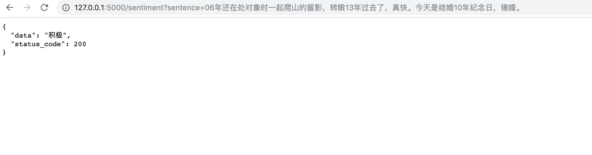

# 微博情感分类实验
  该项目是使用pytorch的基于TexctCNN， 以及双向循环神经网络的文本分类实验：对微博的短博文进行情感二分类。当然， 该项目也可以扩展为多分类问题。
   
## 项目的整体结构 
```
├── api.py             用于预测的api程序
├── configs.py         配置文件
├── data               原始数据
├── dataset.py         数据格式转换
├── dictionary         用户自定义词典
├── embeddings         词向量
├── evaluation.py      模型在测试集上测试效果
├── main.py            主程序
├── model              各种文本模型
├── models_storage     模型保存目录
├── train.py           训练相关函数
└── utils.py           工具函数
```

## 使用方法
首先先确保安装好所需要的模块（python3.6+)
```
pip install -r requirements.txt
```

### 训练模型  
（1） 准备好数据
   data目录下准备好训练数据集：train.csv、val.csv(如果要在训练中实时获取validation accuracy的话)
 数据要保证有以下字段：data(文本字段)、 label(分类标签， 该例分为0和1， 0代表消极， 1代表积极)。本项目使用的数据来源于[这里](https://github.com/dengxiuqi/weibo2018)。  
 **重要提醒**： 由于使用torchtext对label进行了tokenize时，会把原始数据当作文本类别， 本例中模型输出的0对应的是积极、1对应的是消极（也就是和原标签的意义相反）
   
（2） 下载词向量  
  从网上下载预训练好的词向量， 比如FastText词向量, 你可从[该处](https://fasttext.cc/docs/en/crawl-vectors.html)
下载一个300维的中文词向量， 然后将解压出来的txt词向量文本文件放在embeddings/fasttext/目录下（在配置文件标明相应的词向量地址）  
 
 (3) 修改配置文件
 如果想用自己的数据， 且数据需要从数据库获取， 则需要修改*configs.py*文件中的数据库链接参数：db_connection&table_name， 同时需要保证数据表有以下字段：
  - data, 文本数据
  - label, 分类标签
  - flag，值为 'train' 或 'test' 二者之一
 同时配置好其他和模型训练相关的参数相应参数。
 
（4）运行
首先可以运行以下代码查看可用参数及含义：
```python
python main.py --help
```
以使用双向循环神经网络模型为例， 可以运行以下代码进行训练：
```python
python main.py --compute-val --model-name birnn  --epoches 20 --save-model-dir models_storage/model_brnn.pt
```
### 测试模型准确率
在evaluation.py加载好模型,以及读取完测试集数据后， 可以运行： 
```python
 python evaluation.py --model-name birnn -lmd models_storage/model_birnn.pt 
```

### 模型的评估结果
|模型名称 |准确率 |
|---|---|
|BiRNN（双向循环神经网络（lstm））| 70.4%|
|TextCNN| 71.2%|
### API调用

```
python api.py --model-name birnn -lmd models_storage/model_birnn.pt
```
#### 请求示例
sentence参数输入文本， 可以返回相应的结果（下例是刘烨的推文）



